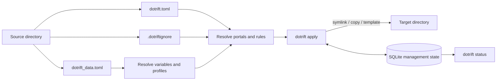

# dotrift

> [!WARNING]
> dotrift is a work in progress. The CLI, configuration format, and behavior may change.

Declarative, template-aware dotfile management in Rust. dotrift projects files
from a source directory into a target directory, typically your home directory,
using `dotrift.toml`. Each file can be deployed as a symlink, copied, or
rendered as a template.

## Overview



The source directory contains the files to manage and the control files that
describe how they should be deployed. `apply` resolves that desired deployment,
checks the target against dotrift's management state, and reconciles the target
directory without silently replacing obstructions.

## Template Render Demo

Given this source template, `shell.tmpl`:

```text
# Generated shell configuration
editor = "{{ editor }}"
hostname = "{{ hostname }}"
```

And this `dotrift_data.toml`:

```toml
[variable]
editor = "nvim"
hostname = "workstation"
```

The rendered target contains:

```text
# Generated shell configuration
editor = "nvim"
hostname = "workstation"
```

Templates support `{{ ... }}` interpolations, `` conditionals, and
`` loops. Profiles can overlay the base variables for different
machines or environments.

## Current Features

- Declarative TOML portals mapping literal or glob source paths to target paths
- Three deploy types: `symlink`, `copy`, and `template`
- Template variables from `dotrift_data.toml`
- Activatable profiles for environment-specific variable overlays
- Gitignore-style `.dotriftignore` filtering
- SQLite management state and managed-path checks
- Interactive obstruction handling before replacing existing paths
- Collision and structural-conflict validation before filesystem changes
- Dry runs with `dotrift apply --dry-run`
- Stale-path cleanup with `--clean-up` and optional empty-directory pruning
- Management reporting with `dotrift status`
- Profile management with `dotrift profile list`, `activate`, `deactivate`, and `show`
