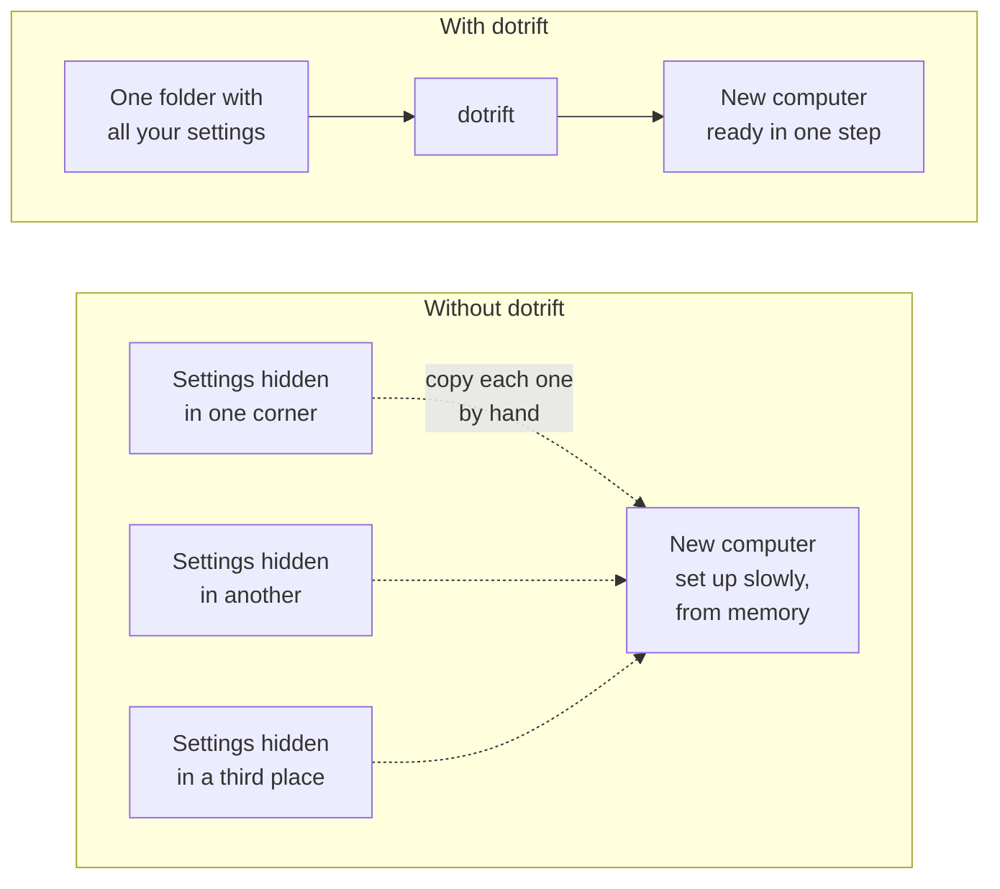
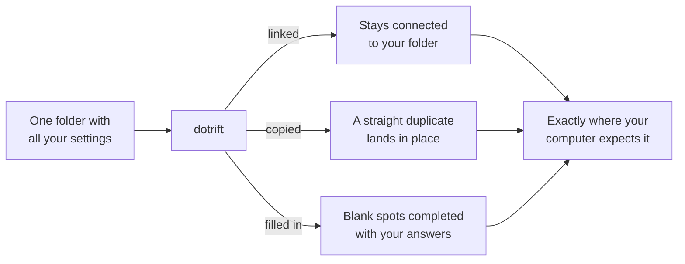

# dotrift

*All your settings in one folder. One command to put them in place.*

dotrift is for anyone who has set up a computer and thought: *"I know I fixed this last time… where was it?"*

## The problem

Your computer keeps the settings that make it feel like yours — how your text editor looks, what your terminal does, the small preferences you've tuned over years — tucked away in hidden corners of the system. Moving to a new computer means hunting them down and copying them over by hand: slow, fiddly, and easy to get wrong.

dotrift turns that around. You keep every setting in one ordinary folder, and dotrift places them where your computer expects to find them.

## What dotrift does

- **Keeps everything together** — one folder holds all your settings instead of them being scattered across hidden corners
- **One step, every time** — each file lands exactly where your computer expects it
- **Fills in the blanks** — the same setup can have small differences per machine, like work versus personal
- **Asks first** — dotrift never replaces a file you've changed without checking with you
- **Keeps track** — it remembers everything it placed, so it can tidy up when your setup moves on

> [!TIP]
> Change a setting once in your folder, and every machine that uses it can pick up the change.

## How it works, in one picture

Every file in your folder travels one of three ways onto your computer:

Set it up once, and every computer you use feels like *yours*.
